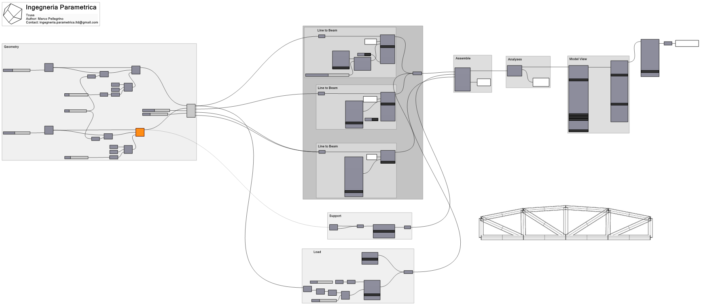

Requirements
============
[GeometryGym](https://geometrygym.wordpress.com/) is required to run the script correctly. It is my favourite plug-in to deal with structural related problem. It is common to use it when you want to export your model in .IFC file or if you want to generate a structural model to run in other packages ( Sap2000, Gsa, Strand, Robot ect). In the example file, it has been used to generate different kind of truss (Howe, Pratt, Warren, Vierendel). It would have been possible even without but sometimes we don't have to reinvent the wheel if the wheel has been already invented!
